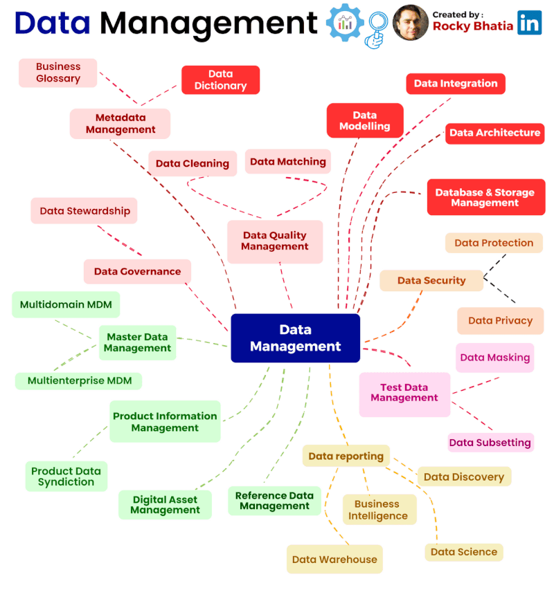

- 👋 Hi, I’m Dina @dinfahi, Extrovert, Alpha and Independent Women. 
- 👀 I’m interested in Public Policy, Coding, and Journalist. 
- 🌱 I’m currently learning Python, HTML, CSS, JS and Non Coding.
- 💞️ I’m looking to collaborate on disability issues, tester for the developer, and librarian data. 
- 📫 How to reach me : dina.fahimaa@gmail.com
- I am also actively preparing for get a doctor scholarship in overseas or Indonesia.
  My ability includes Web designer, writing, library management and avid reader.
  
<!---
dinfahi/dinfahi is a ✨ special ✨ repository because its `README.md` (this file) appears on your GitHub profile.
You can click the Preview link to take a look at your changes.
--->
